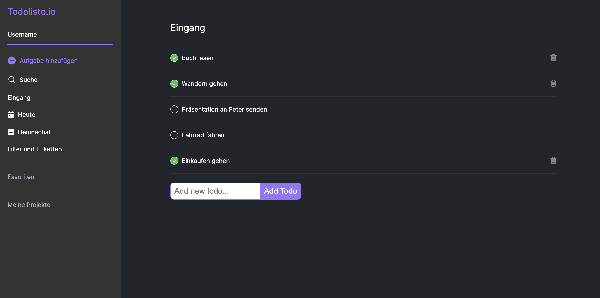

# Todolisto in the style of Todoist

This project was created during a full-stack developer bootcamp and is the result of my personal initiative that went far beyond the original scope.

The core of this project is based on the MERN stack (MongoDB, ExpressJS, ReactJS, NodeJS), with the connection to MongoDB made via mongoose. Mongoose is an Object Data Modeling (ODM) library for MongoDB and Node.js. It provides a schema-based solution for modeling and managing data in a MongoDB database

My primary goal was to deepen my understanding of backend development, especially working with Express.js and mongoose. Another focus was the development of software architecture (Layerd Architecture) in the backend and the use of async await to strengthen the connection between backend and frontend.

Todolisto, inspired by the design of Todoist, is still in the development phase. It is currently being operated with test data.

Please note: Todolisto is currently not responsive and only optimized for desktop use. The project is not yet live and can only be viewed by cloning. Clone here -> [GitHub Repo](https://github.com/wilhelm-lenz/todo-list-reactjs-nodejs).

## Table of Contents

- [Overview](#overview)
  - [Screenshot](#screenshot)
  - [Links](#links)
- [My process](#my-process)
  - [Built with](#built-with)
  - [What I learned](#what-i-learned)
  - [Continued development](#continued-development)
  - [Useful resources](#useful-resources)
- [Author](#author)

## Overview

### How does the Todolist work?

- Initially, visitors see a dashboard where they can later sign in. Upon first loading, the Todos for the current date are displayed under the "Today" tab on the left side.
- The dashboard is divided into two parts: the navigation on the left and the display of the Todos on the right.
- In the left navigation, the logged-in user can add tasks, search for Todos, view all Todos in "Inbox", view the current Todos for the current date, view the Todos for the next 3 days, and filter by Todo properties. "Favorites" and "My Projects" are planned for future functionalities.
- Currently, only the "Inbox" and "Today" sections are functional.
- On the right side of the dashboard, users can view their tasks in both the "Inbox" and "Today" sections, add new tasks, mark them as completed, or delete them. By clicking the checkbox circle on the left edge of a task, it is marked as completed. The circle then fills with a checkmark on a green background. At the same time, the task is crossed out. A trash can icon appears on the right edge, allowing the task to be deleted if necessary.

### Screenshot

#### Desktop:

Today's Dashboard

Inbox Dashboard

### Links

- Solution Backend URL: [backend](https://github.com/wilhelm-lenz/todo-list-reactjs-nodejs/tree/main/backend)
- Solution Frontend URL: [frontend](https://github.com/wilhelm-lenz/todo-list-reactjs-nodejs/tree/main/frontend)

## My Process

### Built With

- Semantic HTML5 markup
- SCSS custom properties
- JavaScript
- React.js
- Node.js
- MongoDB
- Mongoose
- Express.js
- Vite.js (Build Tool)
- VS Code
- Git

### What I Learned

#### Backend:

In the backend, I acquired extensive knowledge about various HTTP methods and routes, especially with regard to API endpoints. Reading and writing files and using JSON files as APIs were also important learning aspects. A particular focus was on software architecture and the use of async await, which significantly expanded my skills in the backend area. A little later, I converted the application to MongoDB. The FileSystem was deleted and a connection via mongoose to MongoDB was created.

#### Frontend:

In the frontend area, I learned to effectively query established endpoints from the backend and ensure smooth navigation between backend and frontend. Displaying and editing data, including the ability to delete, modify, and add new data, were deepened here. Especially valuable was the experience of working efficiently with data provided by the backend in the frontend.

### Continued Development

Several important improvements are planned for the next development phase of Todolisto:

- Introduction of Responsive Design: an important upcoming change is the switch to a fully responsive design. This is crucial to ensure an optimal user experience on different devices, from desktops to mobile devices.

- Creating a user dashboard: A key point will be the development of a user dashboard. This is where users can log in to manage their todos. This dashboard will increase efficiency and security when managing the todo list.

- Expansion and improvement of Todolisto: The platform will be enriched with real content and the overall design and functionality will be improved.

- Integration of MongoDB: The integration of MongoDB will significantly expand the data management capabilities of Todolisto. This change is strategically important to increase the scalability and flexibility of the application. -> Already implemented!

### Useful Resources

The following resources were particularly helpful in the development of the Todolist:

- Open Color [@open color](https://yeun.github.io/open-color/) : This open-source color scheme, optimized for UI design, was a valuable aid for designing the user interface. Its range of harmonious colors enhanced the aesthetic appeal and user experience of the Todolist.
- NodeJS Documentation [@nodeJS](https://nodejs.org/docs/latest/api/) : This comprehensive resource for backend development provided detailed information on NodeJS functionalities. It was instrumental in streamlining the server-side development process and ensuring efficient implementation of backend logic.
- ExpressJS Documentation [@expressJS](https://expressjs.com/) : Essential for understanding and implementing the ExpressJS framework, this documentation was critical for the development of robust and scalable server-side applications.
- MongoDB Documentation [@mongoDB](https://www.mongodb.com/docs/) : The official MongoDB documentation was an indispensable resource for understanding and implementing database solutions. It offered comprehensive insights into MongoDB's NoSQL database structure, facilitating efficient data storage, retrieval, and management.
- Mongoose Documentation [@mongoose](https://mongoosejs.com/) : This documentation was crucial for modeling and managing data in MongoDB. Mongoose provided a schema-based approach to MongoDB document validation, casting, and business logic application, making the database interactions more structured and easier to manage.
- Vite Guide [@vite](https://vitejs.dev/guide/) : This guide proved to be an invaluable resource for utilizing this modern frontend build tool. It significantly enhanced the frontend development process, particularly in improving build efficiency and speed.

These resources played a crucial role in various aspects of the project, from UI design to server-side development and data management. They provided the necessary guidance and tools to develop a functional, aesthetically pleasing, and user-centric Todolist.

## Author

- Wilhelm Lenz - [@wilhelm-lenz](https://github.com/wilhelm-lenz)
