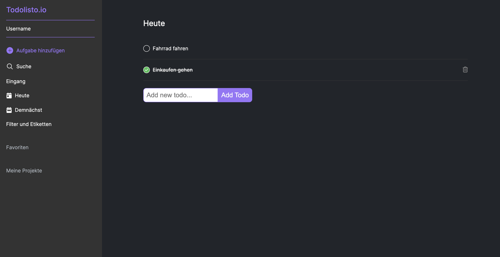

# Todolist in the Style of Todoist

This project emerged during a Full-Stack Developer Bootcamp and is the result of my personal initiative, which extended far beyond the original scope.

The core of this project is based on the MERN stack (MongoDB, ExpressJS, ReactJS, NodeJS), though currently it's implemented without MongoDB, meaning there's no database integration.

My primary goal was to deepen my understanding of backend development, particularly in working with Express.js. Another focus was on developing the software architecture in the backend and using async await to strengthen the connection between backend and frontend.

The Todolist, inspired by the design of Todoist, is still in the development phase. Currently, it operates with test data.

Please Note:
The Todolist is currently not responsive and is optimized only for desktop use. The project is not yet live and can only be viewed by cloning it. Clone here -> [GitHub Repo](https://github.com/wilhelm-lenz/todo-list-reactjs-nodejs).

## Table of Contents

- [Overview](#overview)
  - [Screenshot](#screenshot)
  - [Links](#links)
- [My process](#my-process)
  - [Built with](#built-with)
  - [What I learned](#what-i-learned)
  - [Continued development](#continued-development)
  - [Useful resources](#useful-resources)
- [Author](#author)

## Overview

### How does the Todolist work?

- Initially, visitors see a dashboard where they can later sign in. Upon first loading, the Todos for the current date are displayed under the "Today" tab on the left side.
- The dashboard is divided into two parts: the navigation on the left and the display of the Todos on the right.
- In the left navigation, the logged-in user can add tasks, search for Todos, view all Todos in "Inbox", view the current Todos for the current date, view the Todos for the next 3 days, and filter by Todo properties. "Favorites" and "My Projects" are planned for future functionalities.
- Currently, only the "Inbox" and "Today" sections are functional.
- On the right side, both in "Inbox" and "Today", Todos can be displayed, new ones added, marked as completed, and deleted. Clicking the circle on the left edge of a Todo marks it as completed, showing it crossed out with a green tick.

### Screenshot

#### Desktop:

Today's Dashboard

Inbox Dashboard

### Links

- Solution Backend URL: [backend](https://github.com/wilhelm-lenz/todo-list-reactjs-nodejs/tree/main/backend)
- Solution Frontend URL: [frontend](https://github.com/wilhelm-lenz/todo-list-reactjs-nodejs/tree/main/frontend)

## My Process

### Built With

- Semantic HTML5 markup
- SCSS custom properties
- JavaScript
- React.js
- Node.js
- Express.js
- Vite.js (Build Tool)
- VS Code
- Git

### What I Learned

#### Backend:

In the backend, I acquired extensive knowledge about various HTTP methods and routes, particularly regarding API endpoints. Reading and writing files, as well as using JSON files as APIs, were also key learning aspects. A special focus was on software architecture and the application of async await, which significantly expanded my skills in the backend area.

#### Frontend:

In the frontend area, I learned to effectively query established endpoints from the backend and ensure smooth navigation between backend and frontend. Displaying and editing data, including the ability to delete, modify, and add new data, were deepened here. Especially valuable was the experience of working efficiently with data provided by the backend in the frontend.

### Continued Development

Several important improvements are planned for the next development phase of the Todolist:

- Introduction of Responsive Design: A major upcoming change is the transition to a fully responsive design. This is crucial to ensure an optimal user experience on various devices, from desktops to mobile devices.

- Creation of a User Dashboard: A central point will be the development of a user dashboard. Here, users can log in to manage their Todos. This dashboard will increase the efficiency and security in managing the Todolist.

- Extension and Improvement of the Todolist: The platform will be enriched with real content, and the overall design and functionality will be improved.

- Integration of MongoDB: The integration of MongoDB will significantly expand the data management capabilities of the Todolist. This change is strategically important to increase the scalability and flexibility of the application.

### Useful Resources

The following resources were particularly helpful in the development of the Todolist:

- Open Color [@open color](https://yeun.github.io/open-color/) : This open-source color scheme, optimized for UI design, was a valuable aid for designing the user interface. Its range of harmonious colors enhanced the aesthetic appeal and user experience of the Todolist.
- NodeJS Documentation [@nodeJS](https://nodejs.org/docs/latest/api/) : This comprehensive resource for backend development provided detailed information on NodeJS functionalities. It was instrumental in streamlining the server-side development process and ensuring efficient implementation of backend logic.
- ExpressJS Documentation [@expressJS](https://expressjs.com/) : Essential for understanding and implementing the ExpressJS framework, this documentation was critical for the development of robust and scalable server-side applications.
- Vite Guide [@vite](https://vitejs.dev/guide/) : This guide proved to be an invaluable resource for utilizing this modern frontend build tool. It significantly enhanced the frontend development process, particularly in improving build efficiency and speed.

These resources played a crucial role in various aspects of the project, from UI design to server-side development and data management. They provided the necessary guidance and tools to develop a functional, aesthetically pleasing, and user-centric Todolist.

## Author

- Wilhelm Lenz - [@wilhelm-lenz](https://github.com/wilhelm-lenz)
